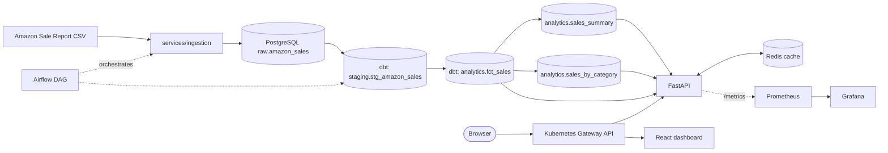

# E-Commerce Sale Analysis

An end-to-end data engineering pipeline that turns a raw Amazon sales export into a monitored, self-healing analytics service running on Kubernetes — ingestion, transformation, an API with caching, a dashboard, orchestration, observability, and CI/CD, all built as a hands-on portfolio project.

## Why this project exists

Most portfolio pipelines stop at "the notebook runs." This one is built to answer the questions a real Data Engineer actually gets asked:

- Does the pipeline survive a dependency going down, or does it just fall over?
- Can someone else redeploy this from the Helm chart alone, or does it only work on one laptop?
- If the database is lost, is there a tested backup — or just an assumption that there is?
- Is there evidence (tests, CI runs, dashboards) that this works, or just a claim that it does?

Every section below links to something that was actually run and verified, not just written down.

## Architecture



The Airflow DAG (`ecommerce_pipeline`) runs the pipeline end to end: `ingest -> dbt run -> dbt test -> invalidate_cache`. See [airflow/dags/ecommerce_pipeline.py](airflow/dags/ecommerce_pipeline.py).

## Tech stack

| Layer | Technology |
|---|---|
| Orchestration | Apache Airflow |
| Transformation | dbt (Postgres adapter) |
| Database | PostgreSQL 16 |
| Cache | Redis 7 |
| API | FastAPI + SQLAlchemy |
| Frontend | React + Vite, served by nginx |
| Runtime | Kubernetes (Kind locally) |
| Deployment | Helm |
| Networking | Kubernetes Gateway API (Envoy via cloud-provider-kind) |
| Monitoring | kube-prometheus-stack (Prometheus + Grafana + Alertmanager) |
| CI/CD | GitHub Actions |
| Container registry | GitHub Container Registry (GHCR) |

## Repository layout

```text
airflow/             Airflow DAG + Docker Compose for local Airflow
dbt/ecommerce/       dbt project: staging + analytics models, tests
helm/ecommerce/      Helm chart for the application (Postgres, Redis, API, frontend, routes, alert rules)
k8s/                 Original raw manifests; superseded by the Helm chart except the shared Gateway and Airflow route
monitoring/          kube-prometheus-stack values, Grafana dashboard, and the monitoring install runbook
scripts/             Operational PowerShell scripts (startup health check, Postgres backup)
services/api/        FastAPI application + pytest suite
services/frontend/   React dashboard
services/ingestion/  CSV -> PostgreSQL loader + pytest suite + CI test fixture
.github/workflows/   CI pipeline
```

## Prerequisites

- Docker Desktop
- A [Kind](https://kind.sigs.k8s.io/) cluster named `ecommerce-local` with the Kubernetes Gateway API installed and a `Gateway` named `ecommerce-gateway` in namespace `gateway-system`
- `kubectl`, `helm`
- [cloud-provider-kind](https://github.com/kubernetes-sigs/cloud-provider-kind), which provides the Gateway's address on Kind
- Python 3.12, Node.js 22 for local development
- `dbt-core==1.12.2` and `dbt-postgres==1.11.0` for running dbt locally

> Creating the Kind cluster and installing the Gateway API CRDs from a completely empty machine isn't scripted yet — see [Known gaps](#known-gaps).

## Getting started after a reboot

Everything here runs locally on Docker + Kind, so it all stops when the machine shuts down.

1. Start Docker Desktop and wait until it's ready.
2. Run the startup health check from the project root:

   ```powershell
   .\scripts\start-profile-a.ps1
   ```

   It checks the Kind cluster and `kubectl` context, starts `cloud-provider-kind.exe` (elevated) if it isn't already running, detects and repairs a stale Gateway Envoy dataplane or a stale Windows `netsh portproxy` mapping, then verifies that the frontend, API, Airflow, Prometheus, Grafana, and the API's `/metrics` endpoint are all reachable through `http://ecommerce.local`, `http://api.ecommerce.local`, and `http://airflow.ecommerce.local`. It throws at the first failing step, naming exactly what to look at.
3. `Profile A is healthy.` means everything is up.

## Deploying changes

`helm/ecommerce` is the single source of deployment truth for PostgreSQL, Redis, the API, and the frontend. Don't `kubectl apply` those resources directly — it will fight with Helm's state.

```powershell
helm lint helm/ecommerce
helm template ecommerce helm/ecommerce | Out-Null
helm upgrade ecommerce helm/ecommerce --namespace ecommerce --wait --timeout 5m
```

Roll back a bad release:

```powershell
helm history ecommerce --namespace ecommerce
helm rollback ecommerce <REVISION> --namespace ecommerce --wait
```

The Gateway (`k8s/gateway/gateway.yml`) and the Airflow route are kept outside the application chart on purpose, so uninstalling the app can never take down shared infrastructure.

## CI/CD

Every push to `main` and every pull request runs [.github/workflows/ci.yml](.github/workflows/ci.yml):

| Job | What it checks |
|---|---|
| `python-tests` | pytest for `services/api` and `services/ingestion` — 21 tests covering `/live`/`/ready`, pagination validation, Redis cache HIT/MISS/BYPASS, CSV column normalization, and DSN construction |
| `frontend` | `eslint` + `vite build` |
| `helm` | `helm lint` + `helm template` |
| `dbt-tests` | Loads a 30-row fixture into a throwaway Postgres service container, then runs `dbt run` and `dbt test` — 19 tests covering row-count consistency across raw/staging/analytics, not-null and uniqueness constraints, and accepted category values |

On push to `main`, once all four jobs pass, two more jobs build the API and frontend Docker images and push them to GHCR, tagged with the commit SHA and `latest` — replacing manually incrementing `v1`/`v2`/`v3` tags.

## Monitoring

Prometheus and Grafana run in the `monitoring` namespace, installed via a pinned `kube-prometheus-stack` release. See [monitoring/README.md](monitoring/README.md) for the full install/upgrade runbook. Quick access:

```powershell
kubectl port-forward --namespace monitoring service/monitoring-grafana 3000:80
kubectl port-forward --namespace monitoring service/monitoring-kube-prometheus-prometheus 9090:9090
```

Three Prometheus alert rules ship with the application chart ([helm/ecommerce/templates/api-prometheusrule.yaml](helm/ecommerce/templates/api-prometheusrule.yaml)):

| Alert | Fires when |
|---|---|
| `EcommerceApiDown` | Prometheus can't scrape any API target |
| `EcommerceApiHigh5xxErrorRate` | 5xx rate exceeds the configured threshold with enough request volume to be meaningful |
| `EcommerceApiHighP95Latency` | p95 request latency exceeds the configured threshold with enough request volume to be meaningful |

## Backup and restore

```powershell
.\scripts\backup-postgres.ps1
```

Opens a temporary port-forward to `postgres-service`, runs `pg_dump` in custom format through a throwaway `postgres:16` container (no local PostgreSQL client install needed), verifies the archive's table of contents, and writes it to `backups/<timestamp>.dump`. That directory is gitignored — a database dump is never committed.

To restore, run `pg_restore` from the same image against a target database:

```powershell
docker run --rm `
  -e PGPASSWORD=<password> `
  -v "${PWD}\backups:/backups" `
  postgres:16 `
  pg_restore -h host.docker.internal -p <port> -U ecommerce -d ecommerce --no-owner --no-privileges /backups/<file>.dump
```

**Restoring into the real `postgres-service` overwrites existing data — confirm the target before running it there.** Restoring into a disposable container first, on a different local port, is the safe way to verify a backup without touching real data.

Verified 2026-09-12: a fresh backup restored into a disposable container reproduced the live database exactly — `raw.amazon_sales` and `analytics.fct_sales` both at 128,975 rows in both the source and the restored copy.

## Reliability

- The API exposes `/live` and `/ready`; PostgreSQL and Redis have their own liveness/readiness probes.
- Redis failure degrades gracefully: the API falls back to PostgreSQL and returns `X-Cache: BYPASS` instead of failing the request.
- PostgreSQL failure is caught by `/ready`, so Kubernetes stops routing traffic to a pod that can't serve requests instead of returning errors to users.
- Resource requests/limits are set on the API, frontend, PostgreSQL, Redis, and Airflow workloads.
- PostgreSQL backups are verified restorable (see above), not just assumed to work.

## Known gaps

- First-time cluster bootstrap (creating the Kind cluster, installing the Gateway API CRDs, initial secrets) isn't scripted end-to-end yet — today it's a manual, undocumented one-time setup.
- No centralized log aggregation; logs are read per-Pod with `kubectl logs`.
- Secrets are plain Kubernetes Secrets; SOPS/Sealed Secrets has been discussed but not adopted.
- Kubernetes hardening (NetworkPolicy, non-root containers, PodDisruptionBudget) isn't applied yet.
- A larger "Profile B" architecture (MinIO/Parquet/Iceberg/Spark/Trino, Kafka if real-time ingestion is ever needed) was scoped as a deliberate future direction, not started — this project stays PostgreSQL-centric by design at its current scale.
